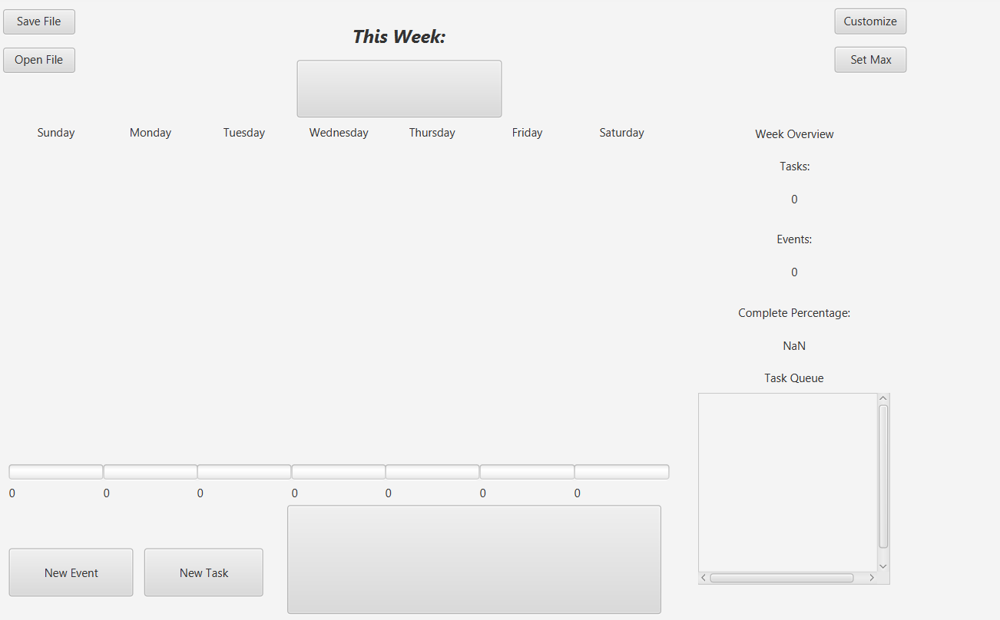

Originally a project for NEU's CS3500, created jointly by Kelsey Hammel, Aaron Huang, and Eric 

## GUI Example

## Link to executable Jar
[Executable jar](jarFiles/bujo.jar)

## Pitch
&nbsp;&nbsp;&nbsp;&nbsp;Ever had a plan in your head that you wanted to remember but forgot when the time was right? Or
perhaps a thought or emotion that you wanted to capture in the moment? Our bullet journal solves both issues with a
simple UI that makes it easy for anyone to pick up and use.

&nbsp;&nbsp;&nbsp;&nbsp;The app opens with a screen of the week that displays each event and task under
their respective days. Tasks and events can be created through the provided buttons on the bottom left of the screen. In
order to mark the task as complete, click on the task inside the week overview. Under each day, there is a progress bar
showing the progress of how many tasks and events you have completed for that specific day. Statistics regarding the
total events, total tasks, and percent of tasks completed is listed to the right of the week view.

&nbsp;&nbsp;&nbsp;&nbsp;Journals can be saved through the provided "Save File" and "Open File" buttons in the upper left
corner of the application. These buttons will open or save your data to a ".bujo" file to be reused in the future. Our
journal also takes care of any commitment warnings, warning you if you already have made a commitment or if you exceed
the maximum amount of tasks and events.

&nbsp;&nbsp;&nbsp;&nbsp;Beside the week overview is the task queue, displaying the list of tasks to be completed in 
order of creation. Tasks will be marked as incomplete in the task queue until marked as complete in the week overview.
Additionally, your tasks and events can be easily organized into categories which can be used almost like folders.

&nbsp;&nbsp;&nbsp;&nbsp;A notepad is available below the week overview for you to put for your own reference.

## SOLID Principles
&nbsp;&nbsp;&nbsp;&nbsp;The Single Responsibility principle is fulfilled through our model classes. Each class delegates
its information to another subclass for information regarding that specific class. For example, the OneWeek class only
handles information regarding a full week, and each individual day is passed into a Day class to be used further.

&nbsp;&nbsp;&nbsp;&nbsp;The Open-Closed Principle is fulfilled through the Journal interface. As a journal is passed,
the interface allows for easy extensibility of any new methods in both the interface and its subclasses without any
necessity of modifying any code.

&nbsp;&nbsp;&nbsp;&nbsp;The Liskov Substitution principle is fulfilled through the Journal interfaces. Throughout the
controller, a Journal interface is passed in which can be any journal that implements that interface. Through this, our
program allows for any subclass of Journal to be used in our controller, model, and view.

&nbsp;&nbsp;&nbsp;&nbsp;The Interface Segregation principle is fulfilled through our the various interfaces we use in
our view, model, and controller. Each interface (such as OneWeekModel in the View folder) allows it to inherit the
methods in the superclass 

&nbsp;&nbsp;&nbsp;&nbsp;The Dependency Inversion principle is fulfilled through the Journal interface, as we can pass i
a different model class (that is not the OneWeek class, for example) that allows for the lack of reliance on the
specific OneWeek class or Journal subclass methods.

# Program Extension
&nbsp;&nbsp;&nbsp;&nbsp;Our program is easily extensible through the various interfaces and methods we use in our controller, model, and view
classes. If the user wishes to have a different model, a different class that implements the Journal interface methods
can be passed through the controller and would still work. For example, adding a menu bar would be as simple as adding
the GUI required to display the menu in the JournalController class, then adding the functionality to do the tasks in
the Controller class methods and processing it through the Journal model class.
